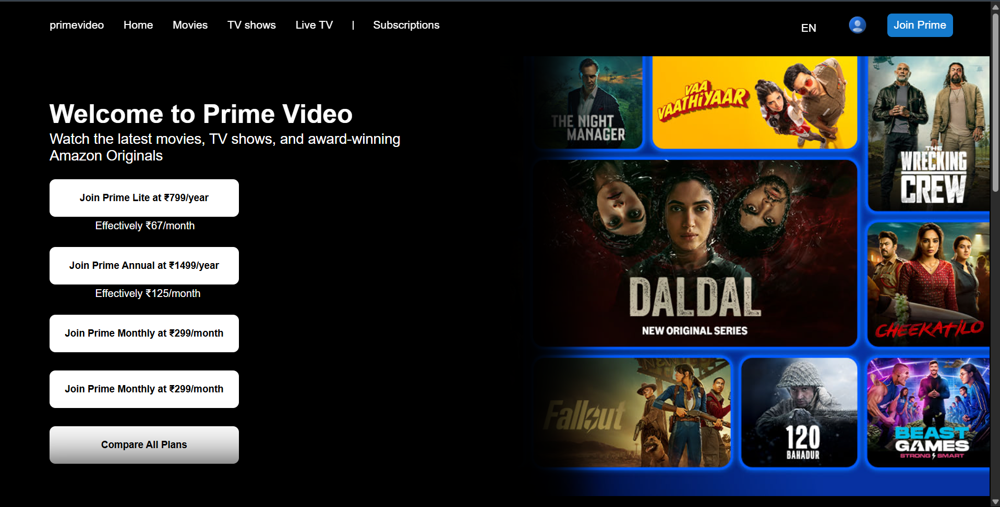
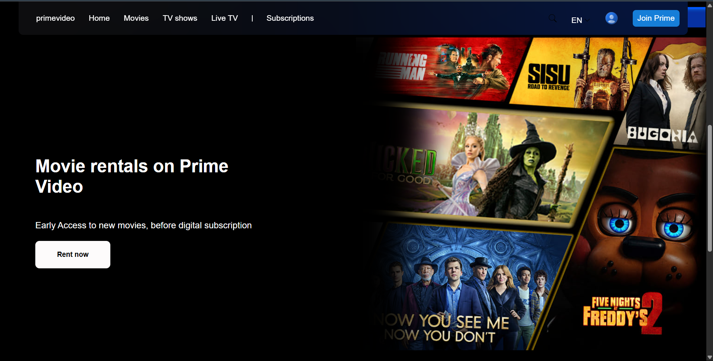
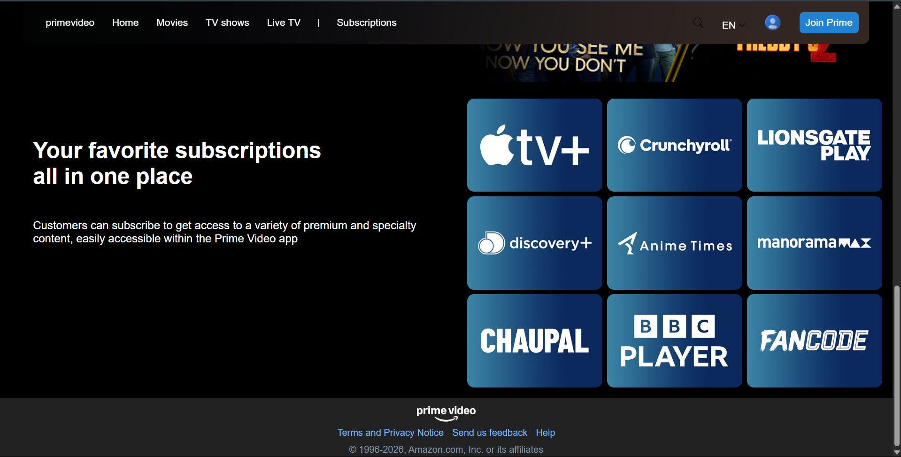

# Prime Video UI Clone

A static UI clone of the Amazon Prime Video homepage built using **HTML and CSS**.  

---

## 📌 Project Overview

The goal of this project was to practice frontend fundamentals by cloning a well-known product UI.  
It helped me understand how complex layouts are structured and styled using pure CSS.

This is **not a functional streaming app** — it is a **UI-only clone**.

---

## 🛠 Tech Stack

- HTML5  
- CSS3  

---

## ✨ Features

- Header / navigation bar layout  
- Hero banner section  
- Movie & TV show card layout  
- Scrollable content sections  
- Footer section  
- Responsive layout 

---

## 🌐 Live Demo

👉 https://code-harsh4141.github.io/prime-video-clone/

---

## 📂 Repository Link

👉 https://github.com/code-harsh4141/prime-video-clone.git

---

## 🚀 What I Learned

- Structuring HTML for large layouts  
- Using CSS Flexbox and Grid  
- Managing spacing, alignment, and positioning  
- Recreating real-world UI designs  
- Organizing frontend projects cleanly  

---

## ⚠️ Disclaimer

This project is created **only for learning and practice purposes**.  
It is **not affiliated with, endorsed by, or connected to Amazon or Prime Video** in any way.

---

## 📸 Screenshots

